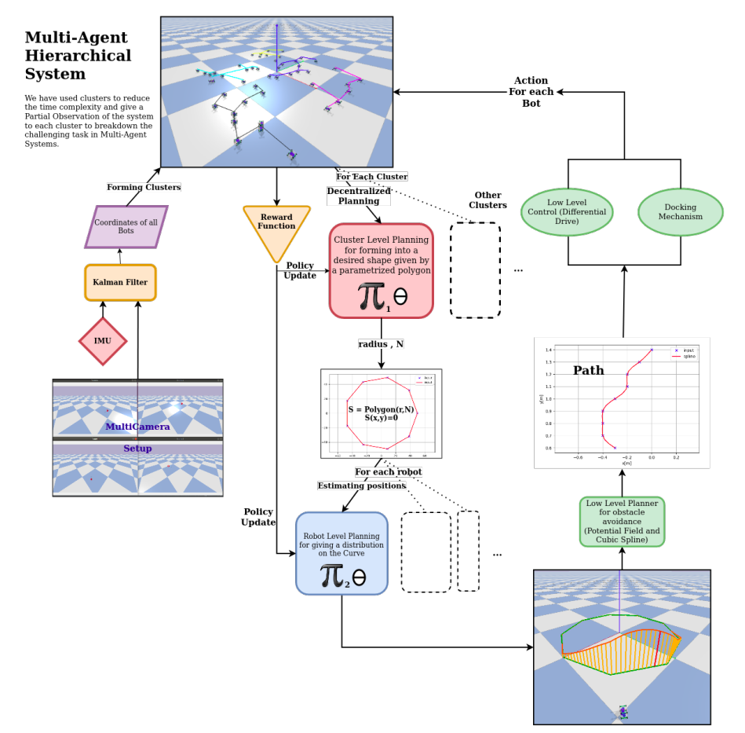
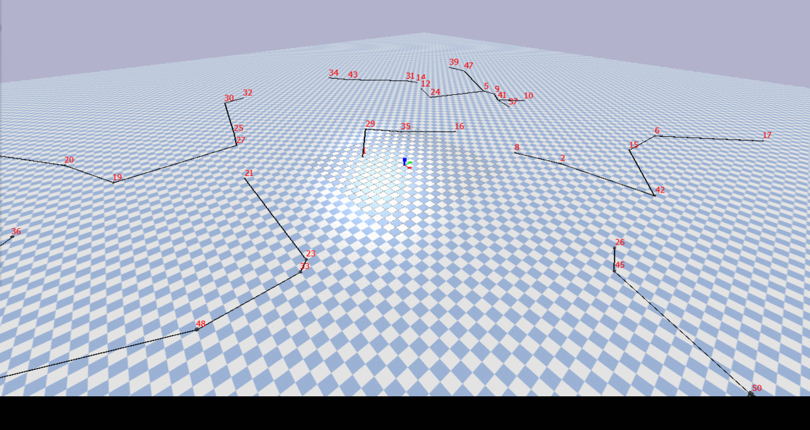

# ModularBot_Planner

This is to make learn a decentralized planning algorithm for a big cluster of modular bots
# *LETS GET IT DONE*

## ToDo
- [X] Choosing a modular bot platform and making mechanical design of a approximate system.
- [ ] Get Shape Shifting and basically control algos for a small cluster
- [X] Representation of the following in smaller clusters and decentralizing the algo
- [ ] Main Planning algorithms for a given task
- [ ] Add more ........

*Swarm robotics*:
Our primary goal is create [swarm intelligence](https://en.wikipedia.org/wiki/Swarm_intelligence) as seen in animals and insects such as bees and schools of fishes, in a collection of bots by making them learn planning algorithms which help coordinate between themselves in creating a unified system. 
A key component is the communication between the members of the group that build a system of constant feedback. The swarm behaviour involves constant change of individuals in cooperation with others, as well as the behaviour of the whole group. The main features to tackle in such a system which may have hundreds and thousands of bots are to simplify and miniaturization of the problem so that it can be tackled locally. 
One way to achieve that is shown here is to create a decentralized system by creating clusters and cluster heads and allowing local computation to occur hence reducing the overall complexity and computation. The cluster nodes are connected and controlled using [minimum spanning tree](https://en.wikipedia.org/wiki/Minimum_spanning_tree), which connects nodes without any cycles and with minimum possible edges and edge weights.

## Workflow

**Creating clusters for decentralized planning and use distributed computation** 
We start by getting position and orientation of each bot using its unique id. We then create clusters using [scikit-learn](https://scikit-learn.org/)'s clustering algorithm [Kmeans](https://scikit-learn.org/stable/modules/generated/sklearn.cluster.KMeans.html), tutorial explaining [Kmeans algorithm in machine learning](https://towardsdatascience.com/understanding-k-means-clustering-in-machine-learning-6a6e67336aa1). This Kmeans algorithm classifies the bot based on their location into the specified number of cluster or bins using unsupervised learning.

**Creating MST for each cluster** 
After placing each bot into its respective cluster, we form a minimum spanning tree from for each cluster using [Prim's Minimum Spaning Tree algorithm](https://www.geeksforgeeks.org/prims-minimum-spanning-tree-mst-greedy-algo-5/). Then we chose the cluster head for each cluster which controls the rest of the bots in its cluster, now we use only the representation of the cluster heads for furthure computation instead of all the nodes, other nodes are taken wrt to these heads.

## Resources
- [Docs with all the links](https://docs.google.com/document/d/1KEJf-jeIi0BJtAnXddLB5JF5d1Ci-cbfW9H89qSSHl4/edit?usp=sharing)
- [Drive with extra pdfs](https://drive.google.com/drive/folders/1T1NNpkDUduwzQ99P27nm3KUAkobiAlMo?usp=sharing)
