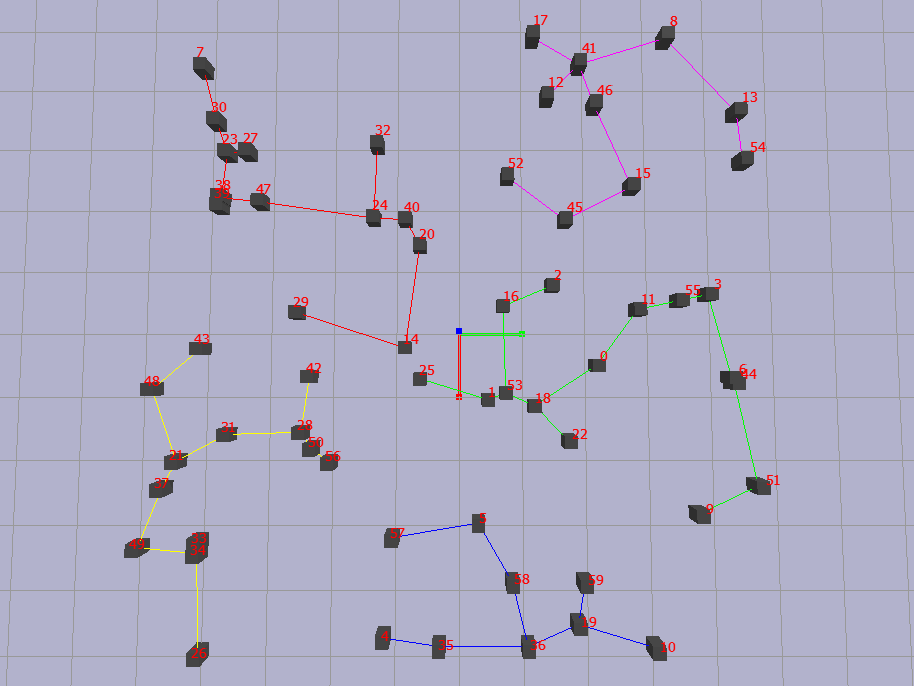

## ModularBot Planner

This repository contains code for the whole planner for the [`gym-iOTA-v0`](https://github.com/Robotics-Club-IIT-BHU/gym-iOTA) Environment which is a modular robot platform which is capable of traversing with 8 wheels on both its surfaces and capable of docking with each other. This repository is aimed to learn a policy that generalizes in the use of this robot. Below I have discussed a brief idea and pipeline of the algorithm and also explained the usage of the code along the gym environment

## Abstract

Abstraction of policy for Multi Agent to generalize the Swarm Behaviour. Allowing easy scaling up and robustness in task. Learning heirarchially optimal policy facilitates meta learning for multi agent setup, resulting in easier learning another task for the swarm. This saves a lot of train time as the policy takes major ammount of time to learn the complex interaction of these individual agents with each other and the environment. As the distribution of the model for these interaction doesnt tend to change drastically between tasks.

## Introduction

The testing has been done on a custom robot platform named iOTA. Which is a simple 4 Wheel drive on both top and bottom plates and hypotetically capable of docking(All tests are simulations with constraints added by simulator, this is done to reduce the complexity of physics).

8 Wheeled Drive             |  Docking Mechanism
:-------------------------:|:-------------------------:
  |  

<!-- -->


The whole setup is simulated in PyBullet, and we have made a simple env for our experimental testbed [`gym-iOTA`](https://github.com/Robotics-Club-IIT-BHU/gym-iOTA). There has been on a simpler 2D version of the Env for easier training and debuggin for representation learning of the environment [`gym-iOTA_2D`](https://github.com/hex-plex/gym-iOTA_2D).

## Installation
This source code can be used either as a library or a standalone code for your needs we need to install `gym-iOTA` first.
```bash
$ mkdir modbot_ws
$ cd modbot_ws
$ pip install gym-iOTA
--- or --- 
$ git clone https://github.com/Robotics-Club-IIT-BHU/gym-iOTA
$ pip install -e gym-iOTA
$ git clone https://github.com/Robotics-Club-IIT-BHU/ModularBot_Planner
$ pip install -e ModularBot_Planner
```
This should install both the gym and the planner you can run a few example scripts to check if everything is working

```bash
$ python classic.py
```
This would check if the environment and the clustering, obstacle avodiance and the control is working properly, It would also propmt plots of the estimated paths so that you can cross verify, if you find there are any bugs please do report or checkout the version of `gym-iOTA` you are using.

```bash
$ python model_play.py --checkpoint results/100500/heir_v2
```
This would load the saved weights and the below pipeline as described.

## Pipeline


Here we have used multiple classical algorithms with learnt methods.
The main parts in the algorithm is.
- Localization
- Clusterring
- High Level Planning using Policy
- Obstacle Avoidance
- Control

The whole library is split into these major sections and is very modular in the terms of there use with other environments or scenarios. I highly encourage to utilize the library for your personal use anywhere you find it useful as most of the parameters are independent of the environment or simulator. Below along side a small description of each modules I have added a simple implementation code.

### Localization

Localization is done using detection from multiple cameras, and averaging the position and pose as the estimates where better than just one camera. Then this pose is infused with odometry and imu using an **Extended Kalman filter**.


```python
# Checkout localization/multiCam.py for complete implementation

from modobot_planner.localization import reconstruction
from modobot_planner.localization import cameraSetup

cam = cameraSetup.pybullet_Camera()     # This is specific for pybullet you can add your camera model in a similar fashion
image = cam.get_image()
mask = threshold(image)                 # threshold is a custom function which you would define to parse the object
coord = reconstruction.get_pos([mask])  # Triangulates the position of the object with array of masks and camera positions
```


### Clustering

The clustering is done using **Kmeans clusters**, The main use of clustering is to divide the Swarm into smaller parts for being able to learn quicker while decreasing the complexity of observation. And also making meaningful interactions as the agent is barely affected by an agent outside it's cluster.



```python
# Checkout classic.py for complete implementation

import gym
import gym_iOTA
from modobot_planner.clustering import cluster

env = gym.make_env("iOTA-v0")

observation, reward, done, info = env.step(dummy_action, dummy_dock)

parents, groups, dictionaries = cluster(observation, 
                                        [iota.base_id for iota in env.iotas],
                                        env.no_of_clusters, 
                                        debug=True,
                                        pClient=env.pClient
                                        )  # Forms clusters in the environment and spans it using a Minimum spanning tree

```

### High Level Planning

The high level planning here refers to estimate goal position of the robot complete a certain task. The high level planning is done using Two policies, The first policy Works on individual cluster estimating parameters of an polygon, while the next estimates the distribution over the polygon and then sampling points off the distribution is taken as the target point for the robot for one action step.


```python
# Checkout model_play.py for complete implementation

import gym
import gym_iOTA
from modbot_planner.coordination import Coordination

env = gym.make("iOTA-v0")
swarm = Coordination()

obs = env.reset()
state_info = gym_iOTA.utils.obs_for_modbot_planner(obs)

# The below execution depends on your requirement

action_dict = swarm.forward(state_info)
action = gym_iOTA.utils.to_action(action_dict)

## OR ##

action_dict = {}
option_vec = swarm.forward_cluster(state_info)
for cluster in state_info["clusters"]:
    cluter_action = swarm.forward_lower(cluster)
    action_dict.update(cluster_action)
action = gym_iOTA.utils.to_action(action_dict)
# This gives more accessiblility to pipeline

obs, rew, done, _ = env.step(action)
```

As it can be seen one policy is under the heirarchy of the other policy and as policy $\pi_1$ is updated less frequently compared to $\pi_2$ The return will not be the same for every action taken by $\pi_1$. **Hierarchical Reinforcement Learning** is much suited in this **Semi-Markov Decision Process** over traditional Reinforcement Learning.
This also allows to learn a heirarchically optimal policy that will facilitates meta learning to different tasks. 

The equation for update for the two policies are given by the following.

<p align="center">
<br/></p>
<p align="center">
<br/></p>
<p align="center">
<br/>
</p>
Here $\tau$ is the number of time steps $\pi_2$ steps between consecutive steps of $\pi_1$

The final output of both combined is.


Where the estimated polygon is seen in green, and the distribution is seen in orange. And the sampled point is seen in red.
```python
# Checkout classic.py for complete implementation

from modbot_planner.coordination import ParamPoly2D

poly = ParamPoly2D(n, r)
poly = poly(n_1, r_1)       # Changing the polyon parameters

point = [pos_x, pos_y]
poly.sample(point, dist)    # Samples a point on the polygon given the agents position and distribution
poly.sample_near(point)     # Samples the nearest point to the agents position
```

### Obstacle Avoidance

After the action is taken the main task is to find a path to the target position without colliding into one another. This is done using **Potential Field Planning**, this was the simplest algorithm for path planning that we could use in pybullet. This could easily be replaced by the nav stack in ROS.


```python
# Checkout planning/simple_cluster_planning.py for complete implementation

from modbot_planner.planning import Spline2D, planning

robot_positions = [..., [cen_i_x, cen_i_y], ...]
obstacles = robot_positions + [..., [obst_j_x, obst_j_y], ...]
paths = planning(robot_positions,
                 target_poses, 
                 [0,0,0.01], 
                 obstacles, 
                 ratio, 
                 False)         # Generates paths for every robot using Potential field 
                                # with parallel execution on multiple threads

sp1 = Spline2D(*paths[i])       # Generates cubic spline for the i th robots path

```

### Control

This was done using simple PD control of a 4WD, Later the docking was done using **Fixed Constraints in simulator** than actuallying designing and simulating a docking mechanism. While our main goal was to work on it when we would work on the hardware. The working wheels switch when the robot is flipped which is sensed using an IMU.


This part is implemented internally in `gym-iOTA` so you may look into its documentation. or you may actually use the utility module of gym_iOTA [[here]](https://github.com/Robotics-Club-IIT-BHU/gym-iOTA/tree/master/gym-iOTA/gym_iOTA/utils)

```python
# For directly controlling the low level control

import gym
import gym_iOTA

env = gym.make("iOTA-v0",
               low_control=True)

action    # nx8 matrix; wheel torques for all the 8 wheels for n robots
dock      # nxn matrix; A upper triangular adjacency matrix and only docked if solution is feasible
env.step(action)
```

## Limitation

After Enumerous reiteration on code, and brainstroming of ideas the project only received limited success. The project was a continual part of learning and implementation of year long journey. There are a few points of failure in the current architecture that I would like to point out.

- **Insufficient Observation** :- The observation for individual agent is complex for a policy \pi_2 to learn, and the representation of the cluster is done with insufficient features to policy \pi_1.
- **Constrained Action Space** :- The current action space for both the policy are rather no encouraging to move away from the cluster or move towards a specific direction to complete the task. The architecture for the highlevel planning must be improved to allow motion in and out the cluster.
- **Bugs in the Environment** :- The potential field algorithm is notourious for its suboptimal or worse infinite loops at corner cases for given parameters. The control is a bare minimum position control using PD and doesnt model the highly complex and dynamic System, hence the interaction of these robots in tightly packed regions are very bad as they are unable to trace the given trajectories. This is mainly true once the robots are docked.

Apart from these the robot platform, as well as the codebase are robust and modular hence can be used in other applications and in future iterations of the project. This project is result of hardwork of its contributors.

## Contributors

<table>
  <tr>
  <td align="center">
     <a href="https://github.com/hex-plex">
    <br /><sub><b>Somnath Sendhil Kumar </b></sub></a><br />
    </td>
    <td align="center">
     <a href="https://github.com/surabhit-08">
    <br /><sub><b>Surabhit Gupta</b></sub></a><br />
	</td>
	<td align="center">
     <a href="https://github.com/rtharungowda">
    <br /><sub><b>R Tharun Gowda</b></sub></a><br />
	</td>
	<td align="center">
     <a href="https://github.com/Kritika-Bansal">
    <br /><sub><b>Kritika Bansal</b></sub></a><br />
	</td>
  </tr>
  <tr>
  <td><sub>Lead,Reinforcement Learning</sub></td>
  <td><sub>Hardware Design</sub></td>
  <td><sub>Clustering</sub></td>
  <td><sub>Path Planning</sub></td>
  </tr>
</table>
