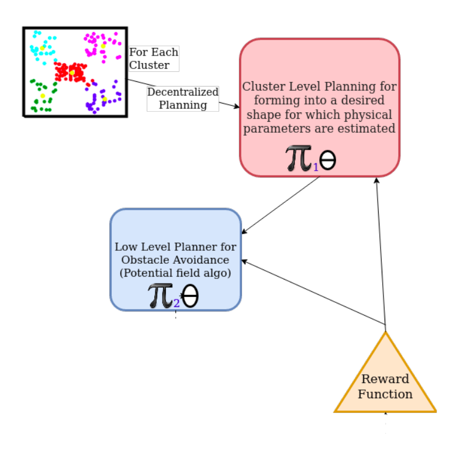

This is my research project at [RoBoReg](https://robotics-club-iit-bhu.github.io/RoboReG/), on which I have been working for over a year till date since November 2020. 

## Abstract

Abstraction of policy for Multi Agent to generalize the Swarm Behaviour. Allowing easy scaling up and robustness in task. Learning heirarchially optimal policy facilitates meta learning for multi agent setup, resulting in easier learning another task for the swarm. This saves a lot of train time as the policy takes major ammount of time to learn the complex interaction of these individual agents with each other and the environment. As the distribution of the model for these interaction doesnt tend to change drastically between tasks.

## Introduction

The testing has been done on a custom robot platform named iOTA. Which is a simple 4 Wheel drive on both top and bottom plates and hypotetically capable of docking(All tests are simulations with constraints added by simulator, this is done to reduce the complexity of physics).

The whole setup is simulated in PyBullet, and we have made a simple env for our experimental testbed [`gym-iOTA`](https://github.com/Robotics-Club-IIT-BHU/gym-iOTA). There has been on a simpler 2D version of the Env for easier training and debuggin for representation learning of the environment [`gym-iOTA_2D`](https://github.com/hex-plex/gym-iOTA_2D).

## Pipeline

Here we have used multiple classical algorithms with learnt methods.
The main parts in the algorithm is.
- Localization
- Clusterring
- High Level Planning using Policy
- Obstacle Avoidance
- Control

### Localization

Localization is done using detection from multiple cameras, and averaging the position and pose as the estimates where better than just one camera. Then this pose is infused with odometry and imu using an **Extended Kalman filter**.

### Clustering

The clustering is done using **Kmeans clusters**, The main use of clustering is to divide the Swarm into smaller parts for being able to learn quicker while decreasing the complexity of observation. And also making meaningful interactions as the agent is barely affected by an agent outside it's cluster.

### High Level Planning

The high level planning here refers to estimate goal position of the robot complete a certain task. The high level planning is done using Two policies, The first policy Works on individual cluster estimating parameters of an polygon, while the next estimates the distribution over the polygon and then sampling points off the distribution is taken as the target point for the robot for one action step.

As it can be seen one policy is under the heirarchy of the other policy and as policy $\pi_1$ is updated less frequently compared to $\pi_2$ The return will not be the same for every action taken by $\pi_1$. **Hierarchical Reinforcement Learning** is much suited in this **Semi-Markov Decision Process** over traditional Reinforcement Learning.
This also allows to learn a heirarchically optimal policy that will facilitates meta learning to different tasks. 

The equation for update for the two policies are given by the following.
$$ \pi_i = \pi_i + \alpha*\delta_i $$
$$ \delta_1 = V(s_{t-1}) + \gamma*R_{t} + ... + \gamma^{\tau+1}*R_{t+\tau} - V(s_{t+\tau})$$
$$ \delta_2 = V(s_{t-1}) + \gamma*R_t - V(s_{t})$$

Here $\tau$ is the number of time steps $\pi_2$ steps between consecutive steps of $\pi_1$

The final output of both combined is.

Where the estimated polygon is seen in green, and the distribution is seen in orange. And the sampled point is seen in red.

### Obstacle Avoidance

After the action is taken the main task is to find a path to the target position without colliding into one another. This is done using **Potential Field Planning**, this was the simplest algorithm for path planning that we could use in pybullet. This could easily be replaced by the nav stack in ROS.

### Control

This was done using simple PD control of a 4WD, Later the docking was done using **Fixed Constraints in simulator** than actuallying designing and simulating a docking mechanism. While our main goal was to work on it when we would work on the hardware. The working wheels switch when the robot is flipped which is sensed using an IMU.

## Limitation

After Enumerous reiteration on code, and brainstroming of ideas the project only received limited success. The project was a continual part of learning and implementation of year long journey. There are a few points of failure in the current architecture that I would like to point out.

- **Insufficient Observation** :- The observation for individual agent is complex for a policy \pi_2 to learn, and the representation of the cluster is done with insufficient features to policy \pi_1.
- **Constrained Action Space** :- The current action space for both the policy are rather no encouraging to move away from the cluster or move towards a specific direction to complete the task. The architecture for the highlevel planning must be improved to allow motion in and out the cluster.
- **Bugs in the Environment** :- The potential field algorithm is notourious for its suboptimal or worse infinite loops at corner cases for given parameters. The control is a bare minimum position control using PD and doesnt model the highly complex and dynamic System, hence the interaction of these robots in tightly packed regions are very bad as they are unable to trace the given trajectories. This is mainly true once the robots are docked.

Apart from these the robot platform, as well as the codebase are robust and modular hence can be used in other applications and in future iterations of the project. This project is result of hardwork of its contributors.

## Contributors

<table>
  <tr>
  <td align="center">
     <a href="https://github.com/hex-plex">
     <b>Somnath Sendhil Kumar </b></a> 
    </td>
    <td align="center">
     <a href="https://github.com/surabhit-08">
     <b>Surabhit Gupta</b></a> 
	</td>
	<td align="center">
     <a href="https://github.com/rtharungowda">
     <b>R Tharun Gowda</b></a> 
	</td>
	<td align="center">
     <a href="https://github.com/Kritika-Bansal">
     <b>Kritika Bansal</b></a> 
	</td>
  </tr>
  <tr>
  <td>Lead,Reinforcement Learning</td>
  <td>Hardware Design</td>
  <td>Clustering</td>
  <td>Path Planning</td>
  </tr>
</table>
